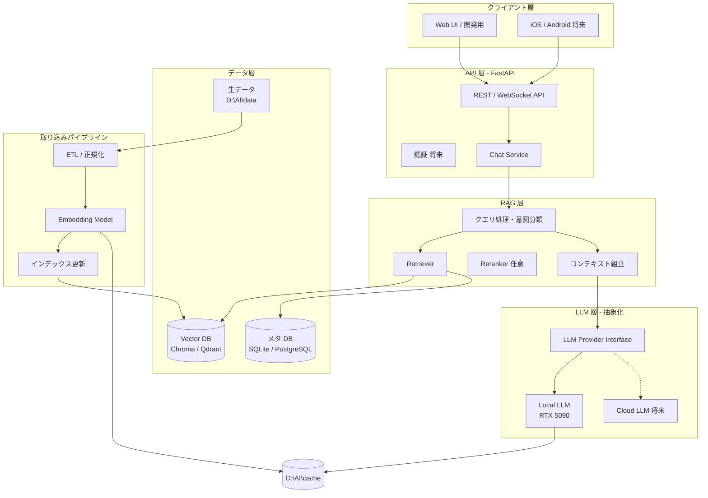
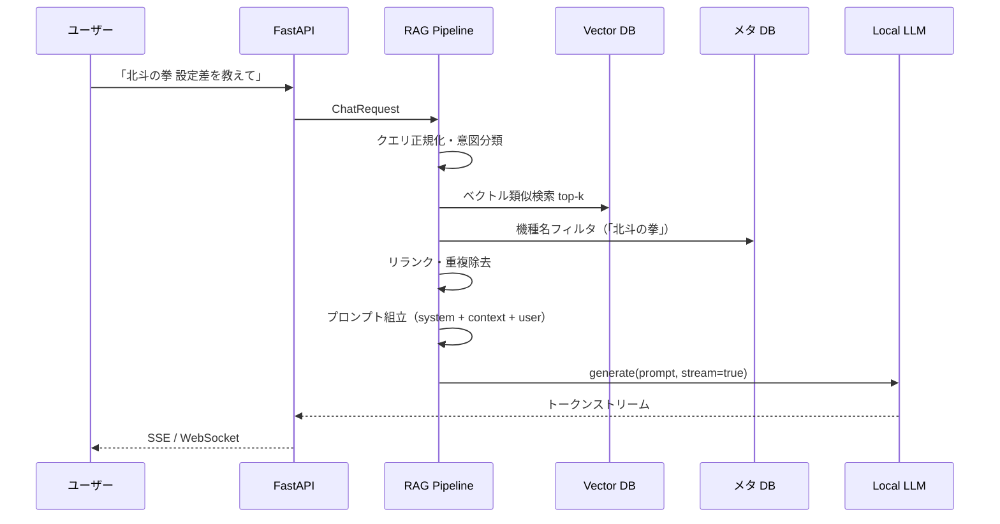
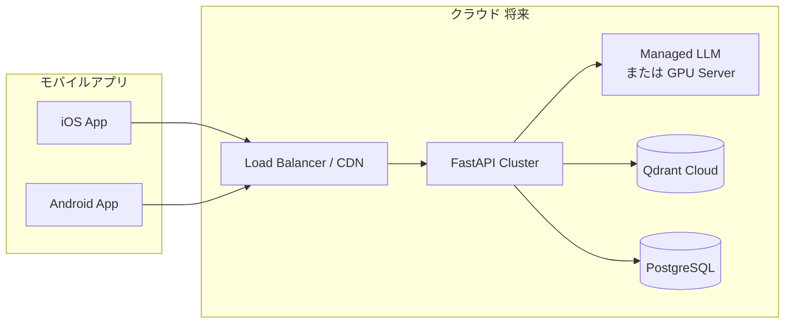

# パチスロ情報AIアプリ — プロジェクト全体設計

## 目的

- ユーザーがパチスロについて自然な日本語で質問できる
- 機種情報、スペック、設定差、天井、ゾーン、解析情報などを回答する
- 将来的に iOS/Android アプリとして公開する
- AI 推論はまず Windows PC 上の NVIDIA RTX 5090 を使用する
- 将来的にはクラウド API/サーバーへ移行できる構成にする

## ローカル保存場所

| 用途 | パス |
|------|------|
| プロジェクト | `D:\AI\projects\pachislot-ai-app` |
| AI モデル | `D:\AI\models` |
| データ | `D:\AI\data` |
| キャッシュ | `D:\AI\cache` |

## 重要な制約

- 巨大な AI モデル、学習データ、キャッシュは GitHub にコミットしない
- GitHub には基本的にソースコード、設定例、ドキュメントのみ保存する
- 秘密鍵や API キーもコミットしない
- 既存の `.gitignore` を尊重する

---

## 1. システム構成

### 全体像



### レイヤー分担

| レイヤー | 役割 | 移行時の扱い |
|---------|------|-------------|
| **Client** | チャット UI、履歴表示 | モバイルは同じ API を呼ぶ |
| **API** | リクエスト受付、バリデーション、レート制限 | クラウドにそのままデプロイ |
| **RAG** | 検索・コンテキスト生成 | ローカル/クラウドで Vector DB の場所だけ変える |
| **LLM Provider** | 推論エンジンの差し替え | 環境変数で `local` ↔ `cloud` 切替 |
| **Data** | 機種マスタ、ドキュメント、ベクトル索引 | データは Git 外、同期スクリプトで管理 |

### 設計原則

1. **LLM と RAG を分離** — 推論エンジンを差し替えても RAG パイプラインは変えない
2. **設定で環境を切替** — パス・モデル名・プロバイダーは `.env` + `config/` で管理（`.env.example` のみ Git 管理）
3. **オフライン優先** — 開発・検証は RTX 5090 上で完結
4. **API ファースト** — フロントは API クライアントに徹し、モバイル化を阻害しない

---

## 2. フォルダ構成

### Git 管理（`D:\AI\projects\pachislot-ai-app`）

```
pachislot-ai-app/
├── README.md
├── DESIGN.md                     # 本設計書
├── .gitignore                    # 既存（models/data/cache/.env 等を除外済み）
├── .env.example                  # 設定テンプレート（秘密情報なし）
├── pyproject.toml                # 依存関係（uv / poetry 推奨）
│
├── config/
│   ├── default.yaml              # デフォルト設定
│   ├── local.yaml.example        # ローカル上書き例
│   └── prompts/                  # システムプロンプト・テンプレート
│       ├── system.jinja2
│       └── rag_context.jinja2
│
├── docs/
│   ├── architecture.md           # 本設計の詳細版
│   ├── data_schema.md            # 機種データのスキーマ定義
│   └── deployment.md             # ローカル / クラウド手順
│
├── scripts/
│   ├── setup_local.ps1           # Windows 初期セットアップ
│   ├── ingest_data.py            # データ取り込み CLI
│   ├── build_index.py            # ベクトル索引構築 CLI
│   └── dev_server.ps1            # 開発サーバー起動
│
├── src/
│   └── pachislot_ai/
│       ├── __init__.py
│       ├── main.py               # FastAPI エントリポイント
│       │
│       ├── api/
│       │   ├── routes/
│       │   │   ├── chat.py       # POST /chat, /chat/stream
│       │   │   ├── machines.py   # GET /machines/{id}
│       │   │   └── health.py
│       │   ├── schemas/          # Pydantic リクエスト/レスポンス
│       │   └── deps.py           # DI（設定、DB セッション等）
│       │
│       ├── core/
│       │   ├── config.py         # 設定読み込み（pydantic-settings）
│       │   ├── logging.py
│       │   └── exceptions.py
│       │
│       ├── llm/
│       │   ├── base.py           # LLMProvider 抽象クラス
│       │   ├── local_vllm.py     # vLLM / llama.cpp / Ollama
│       │   ├── cloud_openai.py   # 将来: OpenAI 互換 API
│       │   └── factory.py        # 設定に応じた Provider 生成
│       │
│       ├── rag/
│       │   ├── embedder.py       # Embedding モデルラッパー
│       │   ├── retriever.py      # ハイブリッド検索（ベクトル + メタ）
│       │   ├── reranker.py       # 任意
│       │   ├── context_builder.py
│       │   └── pipeline.py       # RAG 全体オーケストレーション
│       │
│       ├── services/
│       │   ├── chat_service.py   # チャットフロー統合
│       │   └── machine_service.py
│       │
│       ├── data/
│       │   ├── models/           # SQLAlchemy / Pydantic ドメインモデル
│       │   ├── repositories/     # DB アクセス
│       │   └── vector_store/     # Chroma / Qdrant アダプタ
│       │
│       └── ingestion/
│           ├── parsers/          # JSON/YAML/Markdown パーサ
│           ├── chunkers/         # チャンク分割（機種単位、セクション単位）
│           └── normalizers/      # 用語正規化（設定差、天井、ゾーン等）
│
├── tests/
│   ├── unit/
│   ├── integration/
│   └── fixtures/                 # 小さなテスト用サンプルデータのみ
│
└── frontend/                     # 開発用 Web UI（将来モバイルと別）
    └── web/                      # React / Vue 等（Phase 2）
```

### Git 外（ローカル専用）

```
D:\AI\
├── projects\pachislot-ai-app\    # ← Git リポジトリ
│
├── models\                         # LLM / Embedding モデル
│   ├── llm\
│   │   └── Qwen2.5-14B-Instruct-GGUF\   # 例
│   └── embedding\
│       └── multilingual-e5-base\        # 例
│
├── data\                           # パチスロ生データ
│   ├── raw\                        # スクレイピング / 手入力の原本
│   ├── processed\                  # 正規化済み JSON/YAML
│   └── exports\                    # インデックス用中間ファイル
│
└── cache\                          # 実行時キャッシュ
    ├── huggingface\                # HF ダウンロードキャッシュ
    ├── embeddings\                 # Embedding 結果キャッシュ
    ├── vector_db\                  # Chroma 永続化
    └── llm\                        # llama.cpp / vLLM キャッシュ
```

**パス参照方針**: `config/default.yaml` にデフォルトを書き、`.env` で `MODELS_DIR=D:\AI\models` のように上書き。コード内にハードコードしない。

---

## 3. 使用技術

### コアスタック

| カテゴリ | 推奨技術 | 理由 |
|---------|---------|------|
| 言語 | Python 3.11+ | LLM/RAG エコシステムが充実 |
| Web API | FastAPI + Uvicorn | 非同期、OpenAPI 自動生成、モバイル連携に適する |
| 設定 | pydantic-settings + YAML | 型安全、環境別切替が容易 |
| パッケージ管理 | uv または poetry | 再現性、Windows 対応 |

### LLM（RTX 5090 ローカル）

| 用途 | 候補 | メモ |
|-----|------|------|
| 推論サーバー | **vLLM** または **llama.cpp server** | 5090 の VRAM を活かすなら vLLM が高スループット |
| モデル形式 | GGUF（llama.cpp）/ AWQ・GPTQ（vLLM） | 14B〜32B クラスが現実的 |
| モデル例 | Qwen2.5-14B-Instruct, Llama-3.x-Japanese 系 | 日本語 QA に強いものを選定 |
| 代替 | Ollama | 開発初期のプロトタイプ向け（後から vLLM へ移行可） |

### RAG

| コンポーネント | 推奨 | 理由 |
|--------------|------|------|
| Embedding | `intfloat/multilingual-e5-base` または `bge-m3` | 日本語 + 専門用語 |
| Vector DB | **Chroma**（ローカル）→ **Qdrant**（クラウド移行時） | Chroma はファイルベースで `D:\AI\cache\vector_db` に配置可能 |
| メタ DB | SQLite（開発）→ PostgreSQL（本番） | 機種名、メーカー、発売日等の構造化検索 |
| チャンク戦略 | 機種 × セクション（スペック / 設定差 / 天井 / ゾーン / 解析） | パチスロ情報の粒度に合わせる |

### データ形式

| 形式 | 用途 |
|-----|------|
| JSON / YAML | 機種マスタ、スペック、設定差表 |
| Markdown | 解析記事、攻略情報（チャンク単位） |
| SQLite | 機種一覧、ユーザー履歴（将来） |

### 開発・品質

| ツール | 用途 |
|-------|------|
| pytest | ユニット / 統合テスト |
| ruff | Lint + Format |
| mypy（任意） | 型チェック |
| Docker（将来） | クラウドデプロイ用 |

### 将来モバイル

| 選択肢 | 特徴 |
|-------|------|
| **React Native + Expo** | JS/TS 一本化、Web UI と共通化しやすい |
| Flutter | UI 一貫性、Dart 単体 |
| ネイティブ（Swift + Kotlin） | 最高 UX、開発コスト大 |

**推奨**: まず FastAPI + 簡易 Web UI で API を固め、モバイルは **React Native** または **Flutter** を Phase 3 で判断。

---

## 4. ローカル LLM と RAG の接続方法

### 処理フロー（1 質問あたり）



### 抽象化インターフェース（概念）

```
LLMProvider (抽象)
├── chat(messages, stream) → AsyncIterator[str]
├── complete(prompt) → str
└── health_check() → bool

実装:
├── LocalVLLMProvider    → http://localhost:8001/v1/chat/completions
├── LocalLlamaCppProvider → http://localhost:8080/completion
└── CloudOpenAIProvider  → https://api.openai.com/v1/... (将来)
```

RAG パイプラインは **常に `LLMProvider` 経由** で推論し、具体的なエンジンを知らない。

### RAG パイプライン詳細

**Phase 1 — シンプル RAG**

1. ユーザー質問を Embedding
2. Vector DB から top-5〜10 チャンク取得
3. メタ DB で機種名が言及されていればフィルタ強化
4. 取得チャンクを `rag_context.jinja2` で整形
5. システムプロンプト + コンテキスト + 質問を LLM に送信

**Phase 2 — ハイブリッド RAG**

- ベクトル検索 + BM25（キーワード）の併用
- 機種名・メーカー名の NER（固有表現抽出）
- 設定差表は構造化データとして直接注入（表形式の方が LLM が正確）

**Phase 3 — エージェント的拡張（任意）**

- 「この機種の天井は？」→ ツール呼び出しで DB 直接参照
- 複数機種比較 → 複数 Retriever 呼び出し

### プロンプト設計（パチスロ特化）

```
[System]
あなたはパチスロ情報に詳しいアシスタントです。
- 提供された参照情報のみに基づいて回答してください
- 情報が不足している場合は「データに含まれていません」と明示してください
- 設定差、天井、ゾーン、解析情報を正確に伝えてください
- 推測や憶測で数値を補完しないでください

[Context]
--- 機種: 北斗の拳 ---
## 設定差
| 設定 | 初当たり確率 | ...
## 天井
...

[User]
設定6と設定1の差を教えて
```

### ローカル LLM サーバー構成（Windows + RTX 5090）

```
┌─────────────────────────────────────────┐
│  Windows PC (RTX 5090)                   │
│                                          │
│  ┌──────────────┐  ┌─────────────────┐  │
│  │ FastAPI      │  │ vLLM Server     │  │
│  │ :8000        │──│ :8001           │  │
│  │ (RAG+API)    │  │ (Qwen2.5-14B)   │  │
│  └──────────────┘  └─────────────────┘  │
│         │                                │
│         ▼                                │
│  ┌──────────────┐  ┌─────────────────┐  │
│  │ Chroma       │  │ Embedding       │  │
│  │ (vector_db)  │  │ (CPU/GPU)       │  │
│  └──────────────┘  └─────────────────┘  │
└─────────────────────────────────────────┘
```

- FastAPI と LLM サーバーは **別プロセス**（GPU メモリ管理・再起動の独立性）
- OpenAI 互換 API（`/v1/chat/completions`）を使えば、将来クラウド API への切替が `.env` 1 行で可能

---

## 5. 開発手順

### Phase 0 — 環境準備（1〜2 日）

1. Python 3.11+ / uv インストール
2. `D:\AI\models`, `D:\AI\data`, `D:\AI\cache` ディレクトリ作成
3. LLM モデルダウンロード（GGUF or AWQ）
4. Embedding モデルダウンロード
5. vLLM または llama.cpp server の動作確認（単体で推論テスト）
6. `.env.example` 作成、`.env` はローカルのみ

### Phase 1 — 最小 API + LLM 接続（1 週間）

1. FastAPI プロジェクト骨格（`src/pachislot_ai/`）
2. `LLMProvider` 抽象 + ローカル実装
3. `POST /chat` — LLM 単体応答（RAG なし）
4. `GET /health` — LLM / API の死活監視
5. ストリーミング応答（SSE）

**完了基準**: curl / Postman で日本語質問に LLM が応答する

### Phase 2 — データスキーマ + 取り込み（1〜2 週間）

1. `docs/data_schema.md` — 機種データの YAML/JSON スキーマ定義
2. サンプル機種 3〜5 件を手入力（`D:\AI\data\processed\`）
3. `ingestion/` — パーサ、チャンカー、正規化
4. `scripts/ingest_data.py` — CLI でデータ → チャンク生成
5. SQLite に機種メタデータ投入

**完了基準**: 機種データが構造化され、プログラムから読める

### Phase 3 — RAG パイプライン（1〜2 週間）

1. Embedding モデル統合
2. Chroma にインデックス構築（`scripts/build_index.py`）
3. Retriever 実装（ベクトル検索 + メタフィルタ）
4. `RAGPipeline` + `ChatService` 統合
5. プロンプトテンプレート調整
6. 評価用 Q&A セット（10〜20 問）で精度確認

**完了基準**: 「北斗の拳の設定差は？」に根拠付きで正答

### Phase 4 — Web UI + 開発体験（1 週間）

1. 簡易チャット UI（React または Streamlit）
2. 開発用 Docker Compose（任意）
3. ログ・メトリクス整備

### Phase 5 — データ拡充 + 品質改善（継続）

1. 機種データ追加（10 → 50 → 100 機種）
2. ハイブリッド検索、リランカー導入
3. 回答品質の A/B テスト（プロンプト改善）
4. 設定差表の構造化注入

### Phase 6 — クラウド移行準備（将来）

1. Docker 化
2. `CloudOpenAIProvider` 実装
3. Qdrant / PostgreSQL への移行
4. CI/CD（GitHub Actions）

### Phase 7 — モバイルアプリ（将来）

→ セクション 6 参照

---

## 6. 将来スマホアプリ化するときの構成

### ターゲット構成



### API 設計（モバイル前提）

| エンドポイント | 用途 |
|--------------|------|
| `POST /v1/chat` | チャット（JSON レスポンス） |
| `POST /v1/chat/stream` | ストリーミング（SSE / WebSocket） |
| `GET /v1/machines` | 機種一覧・検索 |
| `GET /v1/machines/{id}` | 機種詳細 |
| `GET /v1/health` | ヘルスチェック |

- **バージョニング** (`/v1/`) を最初から入れる
- **OpenAPI スキーマ** からモバイル SDK 自動生成（Swift / Kotlin / TypeScript）
- 認証は Phase 7 で JWT / OAuth2 を追加

### モバイル ↔ バックエンド接続パターン

| 段階 | 構成 | 説明 |
|-----|------|------|
| 開発中 | PC の FastAPI を LAN 経由で参照 | `http://192.168.x.x:8000` |
| テスト | クラウドに FastAPI デプロイ + ローカル LLM or クラウド LLM | TestFlight / 内部テスト |
| 本番 | クラウド API + Managed LLM | App Store / Google Play 公開 |

### フロントエンド方針

```
frontend/
├── web/           # Phase 4: 開発・検証用（React + Vite）
└── mobile/        # Phase 7: React Native (Expo) 推奨
    ├── app/       # 画面
    ├── api/       # OpenAPI 生成クライアント
    └── components/
```

- **Web UI と Mobile で API クライアントを共通化**（TypeScript）
- チャット UI、機種検索、履歴保存を共通コンポーネント化

### ローカル → クラウド移行チェックリスト

| 項目 | ローカル | クラウド |
|-----|---------|---------|
| LLM | vLLM @ localhost:8001 | OpenAI API / 自前 GPU サーバー |
| Vector DB | Chroma (`D:\AI\cache`) | Qdrant Cloud / self-hosted |
| メタ DB | SQLite | PostgreSQL (RDS 等) |
| モデル | `D:\AI\models` | 不要（API 経由）or S3 |
| 設定 | `.env` | 環境変数 / Secrets Manager |
| デプロイ | `uvicorn` 手動 | Docker + Kubernetes / Railway / Fly.io |

**移行時に変えるのは `.env` と `config/` のみ**。`LLMProvider` / `VectorStore` の実装差し替えで対応。

---

## 補足：`.gitignore` との整合

既存の `.gitignore` は以下をすでに除外しており、本設計と一致している。

- `.env` / `.env.*`（`.env.example` は除外しない）
- `models/`, `data/`, `cache/`, `*.gguf`, `*.safetensors` 等
- `logs/`, `checkpoints/`, `wandb/`

追加で検討する項目（実装時）:

```gitignore
# ローカル Vector DB（cache 配下だが明示も可）
vector_db/

# ローカル SQLite（開発 DB）
*.db
dev.db
```

---

## 次のステップ

1. 本設計のレビュー・修正
2. Phase 0 の環境構築
3. Phase 1 の FastAPI + LLM 最小構成の実装
